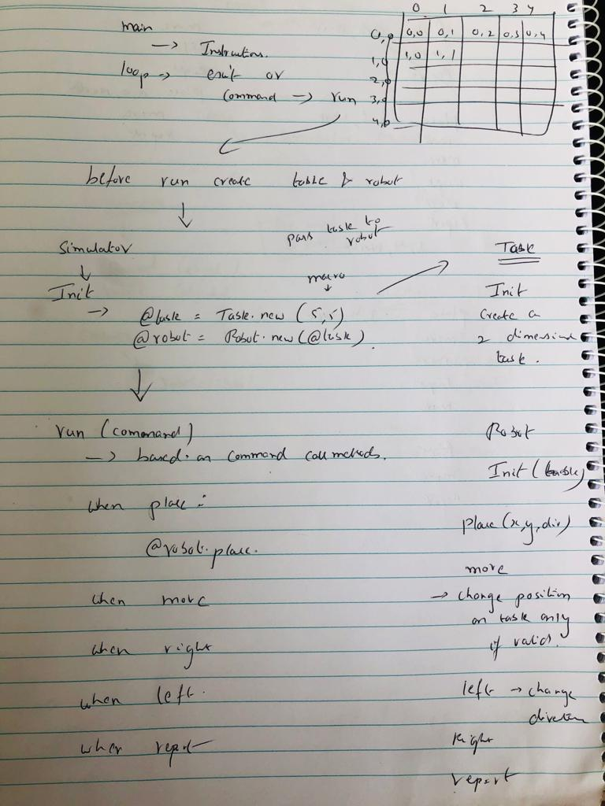
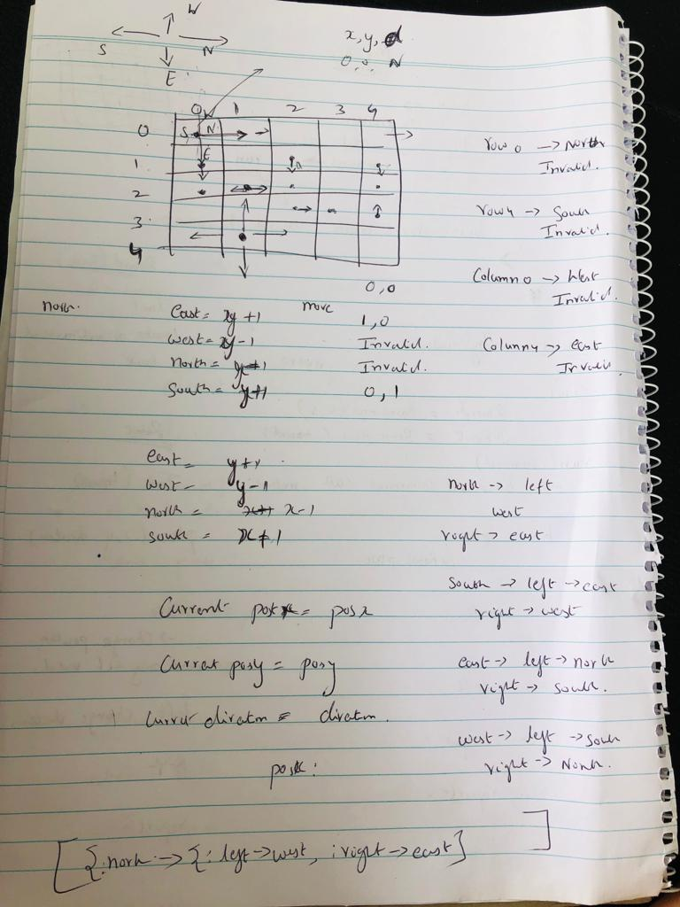

# Toy Robot Simulator - Terminal App

## How to set up and run this project.

- clone the repo

  `cd toy_robot_simulator/src`

  `bundle`

   `ruby app.rb`

- Test: `rspec spec`

### Dependencies

- ruby version: `ruby 2.7.3`

- Bundler version : `2.1.4`

- Gems : 

  ```
  rspec - For Testing
  colorize -  To display success and error message
  ```

## Specification

### Description

- The application is a simulation of a toy robot moving on a square tabletop, of dimensions 5 units x 5 units.
- There are no other obstructions on the table surface.
- The robot is free to roam around the surface of the table, but must be prevented from falling to destruction. Any movement that would result in the robot falling from the table must be prevented, however further valid movement commands must still be allowed.
- Create an application that can read in commands of the following form:

```
PLACE X,Y,F
MOVE
LEFT
RIGHT
REPORT
```

- PLACE will put the toy robot on the table in position X,Y and facing NORTH, SOUTH, EAST or WEST.
- The origin (0,0) can be considered to be the SOUTH WEST most corner.
- The first valid command to the robot is a PLACE command, after that, any sequence of commands may be issued, in any order, including another PLACE command. The application should discard all commands in the sequence until a valid PLACE command has been executed.
- MOVE will move the toy robot one unit forward in the direction it is currently facing.
- LEFT and RIGHT will rotate the robot 90 degrees in the specified direction without changing the position of the robot.
- REPORT will announce the X,Y and F of the robot. This can be in any form, but standard output is sufficient.
- A robot that is not on the table can choose the ignore the MOVE, LEFT, RIGHT and REPORT commands.
- Input can be from a file, or from standard input, as the developer chooses.
- Provide test data to exercise the application.

### Constraints

The toy robot must not fall off the table during movement. This also includes the initial placement of the toy robot. Any move that would cause the robot to fall must be ignored.

### Game as it is


### Example Input and Output

1.

```
PLACE 0,0,NORTH
MOVE
REPORT

Output: 0,1,NORTH
```

2.

```
PLACE 0,0,NORTH
LEFT
REPORT

Output: 0,0,WEST
```

3. 

```
PLACE 1,2,EAST
MOVE
MOVE
LEFT
MOVE
REPORT

Output: 3,3,NORTH
```

4.

```
PLACE 3,3,WEST
MOVE
MOVE
RIGHT
MOVE
REPORT

Output: 1,4,NORTH
```


### Validations

1. **Suggest a turn if robot cannot be moved on the table in a particular direction**

```
PLACE 3,4,WEST
MOVE
MOVE
RIGHT
MOVE
invalid move turn right to move
RIGHT
MOVE
REPORT

Output: 2,4,EAST
```

2. **The first valid command to the robot is a PLACE command. Application discards other commands until place command is run**

```
MOVE
place command must be run first
REPORT
place command must be run first
LEFT
place command must be run first
RIGHT
place command must be run first
PLACE 1,2,NORTH
done
```

3. **Place command must have valid arguments passed in the order posx,posy and direction**

```
PLACE north
Invalid command: Ensure posx, posy and direction is passed to the place command
            example input : PLACE 0,0,NORTH
PLACE 12north
Invalid command: Ensure posx, posy and direction is passed to the place command
            example input : PLACE 0,0,NORTH
PLACE 1,2
Invalid command: Ensure posx, posy and direction is passed to the place command
            example input : PLACE 0,0,NORTH
PLACE 0,0,NORTH
done
```

4. **Valid directions are only NORTH|SOUTH|EAST|WEST**

```
PLACE 1,2,nor
Invalid direction
PLACE 1,2,sou
Invalid direction
PLACE 1,2,SOUTH
done
```

5. **Position outside of table range is ignored**

```
PLACE 10,10,NORTH
choose index between 0..4
PLACE 4,4,NORTH
done
```

6. **Position type validated**

```
PLACE 1,abc,NORTH
Invalid position type
PLACE 1,2,NORTH
done
```


### Approach to the problem

First I went through the instruction and jotted down the requirement and the constraints of the app, then I started looking into designing the app structure. I thought about the classes , how should I separte the classes and what should be the methods in each of them. Initially I wanted to take an MVC approach but then decided it could be an overkill and took the KIS (Keep it simple) approach.

I did a pen and paper scribble of the clases and methods and reasoning around separting code into different files. I decided to go with three classes.

**Simulator**:  Initialise table and robot object. Validates the command and runs the app based on the command executed.

**Table**: Initialise a 5*5 table with rows and columns. If I had the time this could be extrapolated to a GUI based table

**Robot**: This is where majority of the code goes into: since most of the functionalites are asscoated with the robot, it made sense to have them defined in the robot class such as place, move, turn(right/left) and report.

**App**: This is the main file which has the instructions to execute the app and a loop to run the simulator until user chooses to exit the app

**Error Handling**: The app has multiple constraints and also since its a terminal app and not GUI based, it is prone to human (input) errors and hence I focussed on handling a number of errors that a user can input and have raised exception for various kinds of errors and handled them all in the main(app) file in one place.

**Debugging**: Once I had a functional app ran through a number of tests, listed the bugs and resolved them.

**Code Refactoring** : Refactored the code further but focussed on keeping it readable and maintainable and also commented the code where appropriate






### Approach around testing

I have used Rspec to test the functionality. Although I believe in TDD, I followed a bit of mixed approach in this case.

During testing I made a few changes to the code, for ex: to read whether a command was successful I decided to output "done" message. and places where the command could not be taken I raised exceptions and handled them in the code instead of displaying puts msg.

I have 10 test suites for this app tetsing various scenarios

- should discard other commands before place
- should raise exceptions
- robot is placed correctly
- robot moves on the table
- robot should rotate right
- robot should rotate left
- robot shouldn\'t exit the table
- should suggest a turn if robot cannot be moved on the table in a particular direction
- robot should report its position
- robot should ignore invalid commands

Can be tested by running the command `rspec spec` from the src folder